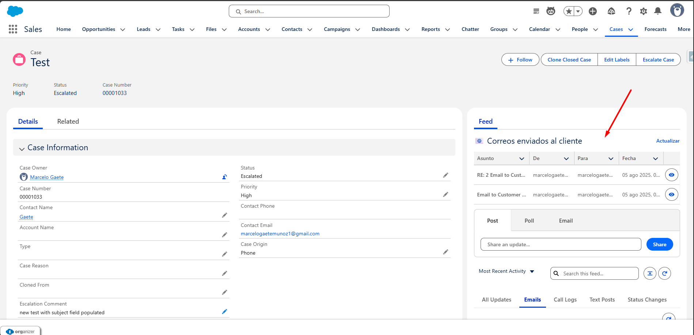
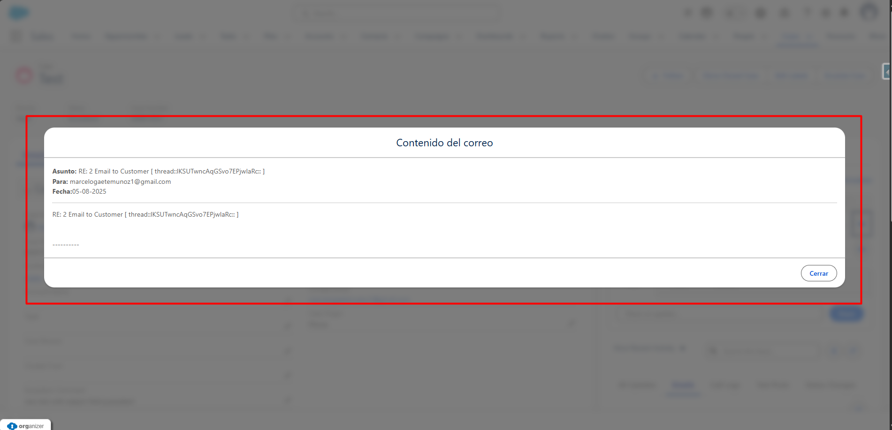
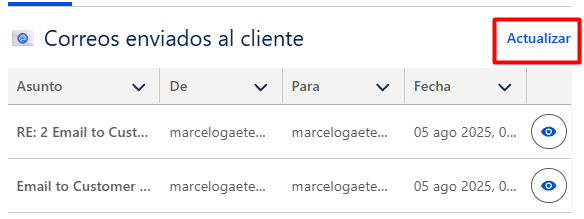

# Email DataTable Component for Salesforce Cases

Este componente Lightning Web Component (LWC) muestra una tabla con los correos electrónicos enviados desde un caso de Salesforce. Incluye funcionalidades como:

- Modal para ver el contenido completo del correo.
- Botón para actualizar la lista de correos.
- Paginación con “Ver más / Ver menos”.
- Filtrado de visibilidad para usuarios de comunidad (externos).

## 🧩 Componentes

- `EmailDataTableController.cls`: Clase Apex que obtiene los correos relacionados al caso.
- `emailDataTable`: Componente LWC que muestra la tabla y el modal.

## 📸 Capturas

### 📌 Vista general

### 💬 Modal del correo

### 🔄 Botón de actualizar

## 🛠️ Requisitos

- Lightning Record Page del objeto **Case**
- Botón estándar “Send Email” habilitado
- Contacto vinculado al caso

